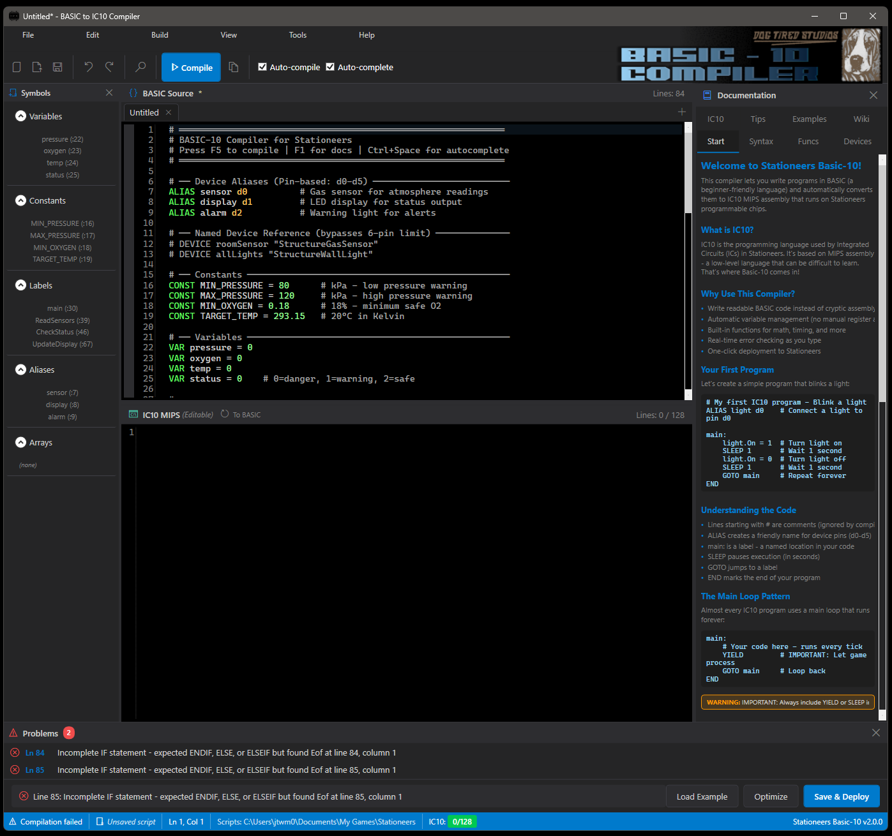

# BASIC to IC10 Compiler for Stationeers

A professional Windows IDE that compiles BASIC programming language code into optimized IC10 MIPS assembly for [Stationeers](https://store.steampowered.com/app/544550/Stationeers/).



## Features

### Modern IDE Experience
- **Professional dark/light themed interface** - Easy on the eyes with theme switching
- **Bidirectional editing** - Edit BASIC *or* IC10 directly, with automatic sync
- **IC10 decompiler** - Convert existing IC10 code back to BASIC
- **Split-pane editor** - BASIC source on top, IC10 output below (both editable)
- **Real-time line counts** - Track IC10 output with 128-line limit warnings
- **Syntax highlighting** - Full color coding for BASIC and MIPS code
- **IntelliSense auto-complete** - Press Ctrl+Space for smart suggestions
- **Find & Replace** - With regex support
- **Real-time error highlighting** - Squiggly underlines for syntax errors

### Powerful Compiler
- **Full BASIC language support** - Variables, expressions, control flow, functions
- **Hybrid mode** - Mix BASIC and IC10 syntax in the same file
- **Language auto-detection** - Automatically detects BASIC vs IC10 input
- **Automatic register allocation** - Uses r0-r13 for variables, r14-r15 as temps
- **Multiple optimization levels** - From fast compile to aggressive size optimization
- **CRC-32 hash calculation** - Matching Stationeers' hash algorithm

### IC10 Simulator
- **Step-through debugging** - Execute IC10 code line by line
- **Register inspection** - View all 16 registers (r0-r15) in real-time
- **Device simulation** - Configure virtual d0-d5 devices with properties
- **Stack visualization** - Monitor push/pop operations
- **Breakpoints** - Pause execution at specific lines

### Device Hash Database
- **Searchable database** - Find device and property hashes quickly
- **CRC-32 calculator** - Generate hashes for any string
- **Copy to clipboard** - Insert hashes directly into your code

### Stationeers Integration
- **Auto-detect game directory** - Finds your Stationeers installation
- **One-click deployment** - Save & Deploy sends code directly to the game
- **Auto-compile on save** - IC10 output updates automatically

### Comprehensive Documentation
- **Built-in quick reference** - Always-visible documentation panel
- **Language reference** - Complete BASIC-IC10 language guide
- **IC10 instruction reference** - All MIPS opcodes documented
- **20+ example programs** - Learn from working code samples

## Installation

### Prerequisites
- Windows 10/11 (64-bit)
- [.NET 8.0 Runtime](https://dotnet.microsoft.com/download/dotnet/8.0) (or use self-contained build)

### Download
Download the latest release from the [Releases](https://github.com/jtwm-0677/Basic-10-Download/releases) page.

### Building from Source

```bash
# Clone the repository
git clone https://github.com/your-repo/BasicToMips.git
cd BasicToMips

# Build for development
dotnet build

# Build release version
dotnet build -c Release

# Create standalone Windows executable (no .NET required)
dotnet publish -c Release -r win-x64 --self-contained true -p:PublishSingleFile=true
```

The standalone executable will be in `bin/Release/net8.0-windows/win-x64/publish/`.

## Quick Start

1. **Launch the application**
2. **Write your BASIC code** in the top editor (or paste IC10 code)
3. **Press F5** or click **Compile** to generate IC10 code
4. **Click Save & Deploy** to send the code to Stationeers

### Your First Program

```basic
' Temperature Controller
ALIAS sensor d0
ALIAS heater d1

DEFINE TARGET 293.15    ' 20°C in Kelvin

main:
    VAR temp = sensor.Temperature

    IF temp < TARGET THEN
        heater.On = 1
    ELSE
        heater.On = 0
    ENDIF

    YIELD
    GOTO main
END
```

### Bidirectional Editing

Both editors are fully editable:

- **BASIC → IC10**: Write BASIC, auto-compiles to IC10
- **IC10 → BASIC**: Paste IC10, click "To BASIC" to decompile
- **Hybrid mode**: Mix both syntaxes with `'` or `#` comments

```basic
' BASIC comment style
# IC10 comment style (also valid in BASIC editor)

ALIAS sensor d0
VAR temp = sensor.Temperature   ' High-level BASIC

# You can even include raw IC10 if needed
```

## Keyboard Shortcuts

| Shortcut | Action |
|----------|--------|
| Ctrl+N | New file |
| Ctrl+O | Open file |
| Ctrl+S | Save file |
| Ctrl+Shift+S | Save as |
| F5 | Compile |
| F6 | Compile and copy to clipboard |
| F9 | Run Simulator |
| Ctrl+Space | Show auto-complete |
| F1 | Show documentation |
| Ctrl+Z/Y | Undo/Redo |
| Ctrl+F | Find |
| Ctrl+H | Replace |

## BASIC-IC10 Language

### Variables & Constants

```basic
VAR temperature = 0      ' Variable declaration
LET x = 5                ' Traditional BASIC assignment
DEFINE MAX_TEMP 373.15   ' Compile-time constant
ALIAS sensor d0          ' Device alias
```

### Control Flow

```basic
' Conditionals
IF condition THEN
    ' code
ELSEIF other_condition THEN
    ' code
ELSE
    ' code
ENDIF

' Loops
FOR i = 1 TO 10 STEP 2
    ' code
NEXT i

WHILE condition
    ' code
    YIELD
WEND

' Subroutines
GOSUB my_routine
END

my_routine:
    ' code
    RETURN
```

### Device Access

```basic
' Read device property
VAR temp = sensor.Temperature

' Write device property
heater.On = 1

' Slot access
VAR item = storage[0].OccupantHash

' Batch operations (all devices of a type)
VAR totalPower = BATCHREAD(-539224550, "PowerGeneration", Sum)
```

### Built-in Functions

| Category | Functions |
|----------|-----------|
| Math | ABS, SQRT, SIN, COS, TAN, ASIN, ACOS, ATAN, ATAN2 |
| Rounding | CEIL, FLOOR, ROUND, TRUNC, INT |
| Comparison | MIN, MAX, SGN, CLAMP |
| Other | EXP, LOG, RND, POW, HASH |
| Stack | PUSH, POP, PEEK |
| Control | YIELD, SLEEP, END |

## IC10 Technical Details

### Registers
- **r0-r15**: General purpose (r0-r13 for variables, r14-r15 temps)
- **sp**: Stack pointer (0-511)
- **ra**: Return address for subroutines

### Hash Calculation
Uses CRC-32 algorithm matching Stationeers:
```basic
' Get hash for device/property names
VAR hash = HASH("Temperature")  ' Returns 466104759
```

### Line Limit
IC10 programs are limited to **128 lines**. The compiler shows warnings when approaching this limit.

## Project Structure

```
BasicToMips/
├── src/
│   ├── Lexer/           # Tokenization
│   ├── Parser/          # AST generation
│   ├── AST/             # Abstract syntax tree
│   ├── CodeGen/         # IC10 code generation
│   ├── IC10/            # IC10 parser & decompiler
│   └── Shared/          # Language detection
├── Editor/
│   ├── Highlighting/    # Syntax highlighting
│   ├── Completion/      # Auto-complete
│   └── ErrorHighlighting/  # Real-time error markers
├── Simulator/           # IC10 step-through debugger
├── Data/                # Device hash database
├── UI/
│   ├── Themes/          # Dark/Light themes
│   ├── Services/        # Compiler, settings services
│   └── *.xaml           # Window definitions
├── docs/                # Documentation
│   ├── UserGuide.md
│   ├── LanguageReference.md
│   ├── IC10Reference.md
│   ├── Examples.md
│   └── QuickReference.md
└── examples/            # Sample BASIC programs
```

## Documentation

- **[User Guide](docs/UserGuide.md)** - Complete usage instructions
- **[Language Reference](docs/LanguageReference.md)** - BASIC-IC10 syntax
- **[IC10 Reference](docs/IC10Reference.md)** - MIPS instruction set
- **[Examples](docs/Examples.md)** - 20+ sample programs
- **[Quick Reference](docs/QuickReference.md)** - Printable cheat sheet

## Contributing

Contributions are welcome! Please feel free to submit issues and pull requests.

## License

MIT License - See [LICENSE](LICENSE) for details.

## Acknowledgments

- Built with [AvalonEdit](https://github.com/icsharpcode/AvalonEdit) for the code editor
- Inspired by the Stationeers community's automation needs
- CRC-32 implementation for Stationeers-compatible hash values
